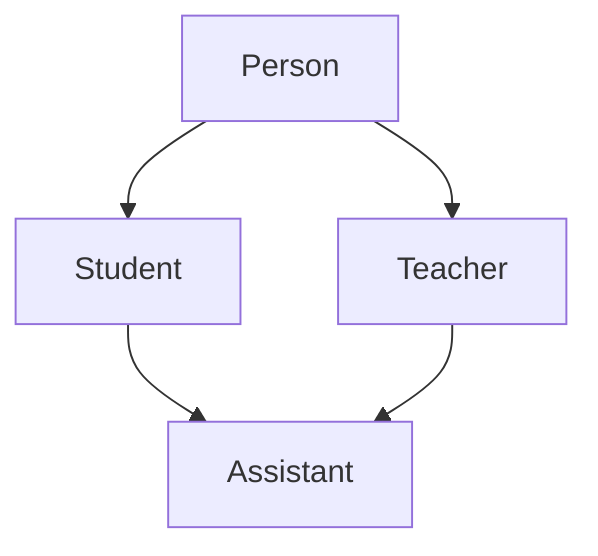

## 一、学习目标

学完本章后，应能够掌握：

1. 继承的概念、语法和三种继承方式。
2. 基类成员在派生类中的访问权限变化。
3. 派生类对象与基类对象、指针、引用之间的转换。
4. 继承体系中的作用域、同名隐藏和函数重载问题。
5. 派生类构造、拷贝、赋值和析构的调用规则。
6. 友元、静态成员与继承之间的关系。
7. 单继承、多继承、菱形继承和虚拟继承。
8. 继承与组合的区别及使用场景。

---

## 二、继承的基本概念

### 2.1 什么是继承

继承允许一个类在保留另一个类已有属性和行为的基础上继续扩展新功能，是类层面的代码复用机制。

- 被继承的类称为**基类（base class）**或**父类**。
- 继承得到的新类称为**派生类（derived class）**或**子类**。
- 派生类对象中包含基类子对象，除此之外还可以拥有自己的成员。

例如，学生和教师都具有姓名、年龄等共同信息，因此可以把这些共同成员放进 `Person` 基类：

```cpp
#include <iostream>
#include <string>

class Person
{
public:
    void print() const
    {
        std::cout << "姓名：" << _name << '\n';
        std::cout << "年龄：" << _age << '\n';
    }

protected:
    std::string _name = "Peter";
    int _age = 18;
};

class Student : public Person
{
private:
    int _studentId = 0;
};

class Teacher : public Person
{
private:
    int _jobId = 0;
};
```

`Student` 和 `Teacher` 都复用了 `Person` 的成员，同时还能增加各自特有的数据和行为。

### 2.2 继承的语法

```cpp
class 派生类名 : 继承方式 基类名
{
    // 派生类新增成员
};
```

常见形式：

```cpp
class Student : public Person
{
};
```

三种继承方式分别是：

```cpp
class B1 : public A {};
class B2 : protected A {};
class B3 : private A {};
```

### 2.3 `class` 和 `struct` 的默认继承方式

- 使用 `class` 定义派生类时，默认继承方式是 `private`。
- 使用 `struct` 定义派生类时，默认继承方式是 `public`。

```cpp
class B : A {};   // 等价于 class B : private A {};
struct C : A {};  // 等价于 struct C : public A {};
```

为了增强可读性，建议始终显式写出继承方式。

---

## 三、继承方式与访问权限

### 3.1 权限变化表

| 基类成员权限 | `public` 继承后 | `protected` 继承后 | `private` 继承后 |
| --- | --- | --- | --- |
| `public` | 派生类中的 `public` 成员 | 派生类中的 `protected` 成员 | 派生类中的 `private` 成员 |
| `protected` | 派生类中的 `protected` 成员 | 派生类中的 `protected` 成员 | 派生类中的 `private` 成员 |
| `private` | 派生类中不可直接访问 | 派生类中不可直接访问 | 派生类中不可直接访问 |

可以用下面的规律辅助记忆：

> 继承后的访问权限，取“基类成员权限”和“继承方式”中限制更严格的一方；基类的 `private` 成员始终不能被派生类直接访问。

权限从宽到严为：

```text
public > protected > private
```

### 3.2 `private` 成员是否被继承

基类的 `private` 数据仍然存在于派生类对象的基类子对象中，但派生类不能直接通过成员名访问它。

```cpp
class Person
{
public:
    int age() const
    {
        return _age;
    }

protected:
    std::string _name;

private:
    int _age = 18;
};

class Student : public Person
{
public:
    void test()
    {
        _name = "Tom";               // 正确：可以访问基类 protected 成员
        // _age = 20;                // 错误：不能直接访问基类 private 成员
        std::cout << age() << '\n';  // 正确：通过基类 public 接口访问
    }
};
```

这也是封装的体现：派生类应通过基类提供的接口使用其私有数据。

### 3.3 三种继承方式的含义

#### `public` 继承

表示“派生类是一种基类”，即 **is-a** 关系。它能够保留基类对外接口，是最常用的继承方式，也是运行时多态通常采用的方式。

```cpp
class Dog : public Animal
{
};
```

可以理解为：`Dog` 是一种 `Animal`。

#### `protected` 继承

基类的 `public` 和 `protected` 成员在派生类中都变为 `protected`。类外不能通过派生类对象使用原来基类的公共接口，但派生类及其后代仍可使用。

#### `private` 继承

基类的 `public` 和 `protected` 成员在派生类中都变为 `private`。它更接近“借助基类实现功能”，而不是公开表达 is-a 关系。

实际开发中通常优先使用 `public` 继承；如果只是为了复用实现，往往应优先考虑组合。

---

## 四、基类与派生类之间的赋值和转换

### 4.1 派生类向基类转换

在可访问的 `public` 继承关系中，派生类对象可以隐式转换为：

- 基类对象；
- 基类指针；
- 基类引用。

```cpp
class Person
{
public:
    std::string name;
};

class Student : public Person
{
public:
    int studentId = 0;
};

int main()
{
    Student student;
    student.name = "Tom";
    student.studentId = 1001;

    Person person = student;       // 对象切片
    Person* personPtr = &student;  // 指向 Student 中的 Person 子对象
    Person& personRef = student;   // 引用 Student 中的 Person 子对象
}
```

### 4.2 对象切片（object slicing）

执行下面的赋值时：

```cpp
Person person = student;
```

只有 `Student` 对象中的 `Person` 部分被复制给 `person`，派生类新增的 `studentId` 等成员会被舍弃。这称为**对象切片**。

```text
Student 对象 = Person 基类部分 + Student 新增部分
                         ↓
Person 对象  = Person 基类部分
```

因此，想保留派生类的完整对象并实现多态时，通常使用基类指针或基类引用，而不是基类对象。

### 4.3 基类不能直接转换为派生类对象

```cpp
Person person;
Student student;

// student = person;  // 错误：Person 中没有完整的 Student 数据
```

基类对象只包含基类部分，不能凭空补出派生类新增成员。

### 4.4 向下转型及其风险

把基类指针转换为派生类指针称为**向下转型（downcast）**。

使用 C 风格强制转换可能绕过类型检查：

```cpp
Person person;
Person* basePtr = &person;

// 危险：basePtr 实际没有指向 Student 对象
Student* studentPtr = (Student*)basePtr;
```

虽然代码可能通过编译，但访问 `Student` 新增成员会产生未定义行为。

对于多态基类，应该优先使用 `dynamic_cast`：

```cpp
class Person
{
public:
    virtual ~Person() = default;  // 使 Person 成为多态类型
};

class Student : public Person
{
public:
    int studentId = 0;
};

void process(Person* person)
{
    if (Student* student = dynamic_cast<Student*>(person))
    {
        student->studentId = 1001;
    }
    else
    {
        std::cout << "该对象不是 Student\n";
    }
}
```

转换规则：

- 指针转换失败时，`dynamic_cast` 返回 `nullptr`。
- 引用转换失败时，会抛出 `std::bad_cast`。
- `dynamic_cast` 需要基类是多态类型，也就是至少具有一个虚函数。
- 只有能从程序逻辑上确认实际对象类型时，才考虑使用 `static_cast` 向下转型。

---

## 五、继承体系中的作用域和名字隐藏

### 5.1 基类与派生类具有独立作用域

基类和派生类分别拥有自己的类作用域。派生类成员与基类成员同名时，派生类成员会隐藏基类中的同名成员。

```cpp
class Person
{
protected:
    int _number = 111;  // 身份证号
};

class Student : public Person
{
public:
    void print() const
    {
        std::cout << "身份证号：" << Person::_number << '\n';
        std::cout << "学号：" << _number << '\n';
    }

private:
    int _number = 999;  // 学号
};
```

使用 `基类名::成员名` 可以显式访问被隐藏的基类成员。

### 5.2 同名函数的隐藏

只要派生类定义了与基类**名字相同**的成员函数，基类中所有同名函数都会被隐藏，参数是否相同并不重要。

```cpp
class A
{
public:
    void func()
    {
        std::cout << "A::func()\n";
    }
};

class B : public A
{
public:
    void func(int value)
    {
        A::func();
        std::cout << "B::func(int): " << value << '\n';
    }
};
```

下面的调用会出错：

```cpp
B b;
// b.func();  // 错误：A::func 被 B::func 隐藏
b.func(10);
```

可以通过 `using` 把基类同名函数引入派生类作用域：

```cpp
class B : public A
{
public:
    using A::func;

    void func(int value)
    {
        std::cout << value << '\n';
    }
};
```

此时两种调用都有效：

```cpp
B b;
b.func();
b.func(10);
```

### 5.3 重载、隐藏和重写的区别

| 概念 | 发生范围 | 主要条件 | 是否与多态有关 |
| --- | --- | --- | --- |
| 重载（overload） | 同一作用域 | 函数名相同，参数列表不同 | 否 |
| 隐藏（hide） | 基类与派生类作用域 | 派生类中出现同名成员 | 否 |
| 重写/覆盖（override） | 基类与派生类作用域 | 基类函数为虚函数，派生类函数签名匹配 | 是 |

建议重写虚函数时使用 `override`，让编译器检查函数签名：

```cpp
class Animal
{
public:
    virtual void speak() const
    {
        std::cout << "Animal\n";
    }

    virtual ~Animal() = default;
};

class Dog : public Animal
{
public:
    void speak() const override
    {
        std::cout << "Dog\n";
    }
};
```

---

## 六、派生类的特殊成员函数

### 6.1 现代 C++ 中的六个特殊成员函数

现代 C++ 通常所说的六个特殊成员函数是：

1. 默认构造函数；
2. 析构函数；
3. 拷贝构造函数；
4. 拷贝赋值运算符；
5. 移动构造函数；
6. 移动赋值运算符。

有些早期资料把“取地址运算符重载”也归入默认成员函数体系。学习现代 C++ 时，应重点掌握上述六个特殊成员函数及编译器生成规则。

### 6.2 派生类构造函数

派生类构造函数需要完成两部分初始化：

1. 调用基类构造函数，初始化基类子对象；
2. 初始化派生类自己的成员。

```cpp
class Person
{
public:
    explicit Person(std::string name)
        : _name(std::move(name))
    {
        std::cout << "Person 构造\n";
    }

protected:
    std::string _name;
};

class Student : public Person
{
public:
    Student(std::string name, int number)
        : Person(std::move(name)),
          _number(number)
    {
        std::cout << "Student 构造\n";
    }

private:
    int _number;
};
```

如果基类没有默认构造函数，派生类就必须在初始化列表中显式调用合适的基类构造函数。

### 6.3 构造顺序

一般情况下，派生类对象的构造顺序是：

1. 虚基类，若存在，由最派生类负责初始化；
2. 直接基类，按继承列表中的声明顺序；
3. 成员变量，按它们在类中的声明顺序；
4. 派生类构造函数体。

注意：成员的真正初始化顺序由**声明顺序**决定，而不是初始化列表的书写顺序。

### 6.4 拷贝构造

派生类的拷贝构造函数应使用基类的拷贝构造函数复制基类部分：

```cpp
class Student : public Person
{
public:
    Student(const Student& other)
        : Person(other),
          _number(other._number)
    {
    }

private:
    int _number = 0;
};
```

`Person(other)` 中的 `other` 会向上转换为 `const Person&`，再调用 `Person` 的拷贝构造函数。

### 6.5 拷贝赋值

派生类拷贝赋值时，需要显式完成基类部分和派生类部分的赋值：

```cpp
class Student : public Person
{
public:
    Student& operator=(const Student& other)
    {
        if (this != &other)
        {
            Person::operator=(other);  // 赋值基类部分
            _number = other._number;   // 赋值派生类部分
        }

        return *this;
    }

private:
    int _number = 0;
};
```

如果成员均支持正确的默认复制语义，通常可以直接使用：

```cpp
Student(const Student&) = default;
Student& operator=(const Student&) = default;
```

### 6.6 析构顺序

析构顺序与构造顺序相反：

1. 先执行派生类析构函数体；
2. 再销毁派生类成员；
3. 再调用直接基类析构函数；
4. 最后销毁虚基类。

可以简单记忆为：

```text
构造：先基类，后派生类
析构：先派生类，后基类
```

编译器会自动调用基类析构函数，因此不要在派生类析构函数中手动调用它。

### 6.7 为什么多态基类需要虚析构函数

如果程序可能通过基类指针删除派生类对象，基类析构函数必须是虚函数：

```cpp
class Person
{
public:
    virtual ~Person() = default;
};

class Student : public Person
{
public:
    ~Student() override
    {
        // 清理 Student 自己管理的资源
    }
};

Person* person = new Student;
delete person;  // 正确调用 Student::~Student()，再调用 Person::~Person()
```

如果基类析构函数不是虚函数，通过基类指针删除派生类对象会产生未定义行为，派生类资源可能无法正确释放。

---

## 七、继承与友元

友元关系具有以下特点：

- 友元关系不能继承；
- 友元关系不能传递；
- 友元关系不是双向关系。

如果一个函数只是基类的友元，它可以访问派生类对象中的**基类私有部分**，但不能访问派生类自己新增的私有或保护成员。

```cpp
class Student;

class Person
{
    friend void display(const Person&, const Student&);

private:
    std::string _name;
};

class Student : public Person
{
private:
    int _studentId = 0;
};

void display(const Person& person, const Student& student)
{
    std::cout << person._name << '\n';  // 正确：display 是 Person 的友元

    // 也能访问 student 对象中的 Person 基类子对象
    std::cout << student._name << '\n';

    // std::cout << student._studentId;  // 错误：不是 Student 的友元
}
```

---

## 八、继承与静态成员

基类的静态成员属于类本身，不属于某个具体对象。整个继承体系共享同一个静态成员实例。

```cpp
class Person
{
public:
    Person()
    {
        ++_count;
    }

    static int count()
    {
        return _count;
    }

private:
    inline static int _count = 0;  // C++17
};

class Student : public Person
{
};

class Graduate : public Student
{
};
```

```cpp
Student s1;
Student s2;
Graduate g;

std::cout << Person::count() << '\n';  // 3
```

虽然可以通过 `Student` 或 `Graduate` 的类名访问可见的基类静态成员，但它们访问的仍是同一个对象，而不是各自拥有一份副本。

---

## 九、单继承、多继承和菱形继承

### 9.1 单继承

一个派生类只有一个直接基类：

```cpp
class Student : public Person
{
};
```

### 9.2 多继承

一个派生类具有两个或更多直接基类：

```cpp
class Assistant : public Student, public Teacher
{
};
```

多继承可以同时组合多套基类接口，但也会增加名字冲突、对象布局、构造顺序和维护成本。

### 9.3 菱形继承

当两个中间类继承同一个基类，最底层派生类又同时继承这两个中间类时，就形成菱形继承：



对应代码：

```cpp
class Person
{
public:
    std::string name;
};

class Student : public Person
{
};

class Teacher : public Person
{
};

class Assistant : public Student, public Teacher
{
};
```

### 9.4 普通菱形继承的两个问题

#### 问题一：数据冗余

`Assistant` 中会存在两份 `Person` 基类子对象：

```text
Assistant
├── Student
│   └── Person
└── Teacher
    └── Person
```

因此，`Person` 的数据会保存两份。

#### 问题二：访问二义性

```cpp
Assistant assistant;

// assistant.name = "Tom";  // 错误：不知道访问哪一份 Person::name

assistant.Student::name = "Student 路径";
assistant.Teacher::name = "Teacher 路径";
```

使用作用域限定符只能解决“访问哪一份”的二义性，不能消除数据冗余。

---

## 十、虚拟继承

### 10.1 虚拟继承解决菱形问题

让两个中间类虚拟继承公共基类：

```cpp
class Person
{
public:
    std::string name;
};

class Student : virtual public Person
{
};

class Teacher : virtual public Person
{
};

class Assistant : public Student, public Teacher
{
};
```

此时 `Assistant` 对象中只保留一份共享的 `Person` 虚基类子对象：

```text
Assistant
├── Student ──┐
├── Teacher ──┼──> 共享的 Person
└─────────────┘
```

因此可以直接访问：

```cpp
Assistant assistant;
assistant.name = "Tom";
```

### 10.2 虚继承的底层理解

编译器需要让不同继承路径都能定位到共享的虚基类子对象。

在常见编译器实现中，对象内部可能包含：

- 虚基表指针；
- 虚基表；
- 从当前子对象到共享虚基类子对象的偏移量。

程序可通过偏移量找到共享的虚基类部分，从而完成指针调整或对象转换。

> 注意：C++ 标准只规定虚继承的行为，不强制编译器采用某一种对象布局。“虚基表指针 + 偏移量”是常见实现，不能把它理解为所有编译器都必须遵循的唯一方式。

### 10.3 虚基类由最派生类初始化

虚基类只存在一份，因此由**最派生类**直接负责初始化：

```cpp
class Person
{
public:
    explicit Person(std::string name)
        : _name(std::move(name))
    {
    }

private:
    std::string _name;
};

class Student : virtual public Person
{
public:
    Student()
        : Person("Student")
    {
    }
};

class Teacher : virtual public Person
{
public:
    Teacher()
        : Person("Teacher")
    {
    }
};

class Assistant : public Student, public Teacher
{
public:
    Assistant()
        : Person("Assistant"),  // 真正负责初始化共享 Person
          Student(),
          Teacher()
    {
    }
};
```

创建 `Assistant` 对象时，`Student` 和 `Teacher` 构造函数中对 `Person` 的初始化会被忽略，真正使用的是 `Assistant` 指定的初始化方式。

### 10.4 是否应该大量使用虚继承

虚继承能够解决共享基类问题，但会增加：

- 对象布局复杂度；
- 构造和初始化规则的复杂度；
- 指针调整成本；
- 阅读、调试和维护难度。

因此，不应为了普通代码复用随意使用虚继承。只有模型确实要求多个继承路径共享同一个基类子对象时，才考虑使用它。

---

## 十一、继承与组合

### 11.1 两种关系

#### 继承：is-a

如果 `BMW` 继承 `Car`，表达的是：

> BMW 是一种 Car。

```cpp
class Car
{
};

class BMW : public Car
{
};
```

#### 组合：has-a

如果 `Car` 中包含 `Tire` 对象，表达的是：

> Car 有一个 Tire。

```cpp
class Tire
{
};

class Car
{
private:
    Tire _tire;
};
```

### 11.2 继承与组合对比

| 对比项 | 继承 | 组合 |
| --- | --- | --- |
| 关系 | is-a | has-a |
| 复用方式 | 复用基类接口和实现 | 通过成员对象的接口复用功能 |
| 可见性 | 派生类可见基类的 `public`、`protected` 部分 | 通常只通过成员对象的公共接口使用 |
| 耦合度 | 较高 | 较低 |
| 封装性 | 基类变化可能明显影响派生类 | 成员对象内部变化通常更容易隔离 |
| 灵活性 | 继承关系通常在编译期固定 | 更容易替换成员对象或策略 |
| 多态 | 运行时多态通常依赖公有继承 | 可配合接口成员、模板等方式实现 |

### 11.3 如何选择

适合使用继承的情况：

- 派生类在语义上确实是一种基类；
- 派生类能够遵守基类对外承诺；
- 需要通过统一基类接口实现运行时多态；
- 基类本身被设计成可扩展的稳定接口。

适合使用组合的情况：

- 只是想复用某个类的功能；
- 两个类之间是“拥有”或“使用”关系；
- 希望降低耦合并增强实现替换能力；
- is-a 关系并不自然。

经验原则：

> 优先考虑组合；只有存在稳定、合理的 is-a 关系时，再使用公有继承。

---

## 十二、常见错误与注意事项

### 12.1 误认为基类私有成员“不在派生类对象中”

正确理解：私有成员通常仍存在于基类子对象中，只是派生类不能直接访问。

### 12.2 把隐藏误认为重载

基类和派生类属于不同作用域，同名函数默认构成隐藏，而不是重载。需要时可使用：

```cpp
using Base::func;
```

### 12.3 派生类赋值时漏掉基类部分

自定义拷贝赋值函数时，不要只赋值派生类自己的成员：

```cpp
Base::operator=(other);
```

### 12.4 使用 C 风格强制向下转型

C 风格转换容易绕过检查。对于多态类型，优先使用 `dynamic_cast` 并检查结果。

### 12.5 基类析构函数不是虚函数

只要可能通过基类指针释放派生类对象，基类析构函数就应声明为 `virtual`。

### 12.6 误以为初始化列表顺序决定构造顺序

直接基类按继承列表顺序构造，成员按声明顺序构造，与初始化列表的书写先后无关。

### 12.7 忘记最派生类负责初始化虚基类

在虚继承体系中，共享虚基类由最派生类直接初始化。

### 12.8 过度暴露 `protected` 数据

`protected` 会让所有派生类直接依赖基类内部实现。更稳妥的设计通常是把数据设为 `private`，再提供受控的 `protected` 或 `public` 成员函数。

---

## 十三、面试题与参考答案

### 13.1 什么是继承？公有继承表达什么关系？

继承是在已有类的基础上构造新类的机制。派生类包含基类子对象，并能扩展新的成员。公有继承表达 is-a 关系，即派生类对象可以被当作基类对象使用。

### 13.2 三种继承方式有什么区别？

区别主要体现在基类 `public` 和 `protected` 成员到达派生类后的权限变化：

- 公有继承保持原权限；
- 保护继承会把它们限制为 `protected`；
- 私有继承会把它们限制为 `private`；
- 基类 `private` 成员在三种继承方式下都不能被派生类直接访问。

### 13.3 什么是对象切片？

派生类对象按值赋给基类对象时，只复制基类子对象，派生类新增成员被舍弃，这一现象称为对象切片。使用基类指针或引用可以避免复制导致的切片，并为运行时多态保留实际对象类型。

### 13.4 重载、隐藏和重写有什么区别？

- 重载发生在同一作用域中，函数名相同而参数列表不同；
- 隐藏发生在继承体系中，派生类同名成员会隐藏基类同名成员；
- 重写发生在虚函数体系中，派生类提供与基类虚函数匹配的实现，并支持运行时多态。

### 13.5 派生类对象的构造和析构顺序是什么？

构造时先初始化虚基类，再初始化直接基类，然后初始化成员变量，最后执行派生类构造函数体。析构顺序与构造顺序相反。

### 13.6 为什么基类析构函数经常需要写成虚函数？

当通过基类指针删除派生类对象时，虚析构函数能够进行动态绑定，先调用派生类析构函数，再调用基类析构函数。若析构函数不为虚函数，这种删除行为是未定义行为。

### 13.7 什么是菱形继承？有什么问题？

两个中间派生类继承同一个基类，最底层类又同时继承这两个中间类，就形成菱形继承。普通菱形继承会导致公共基类数据保存多份，并产生访问二义性。

### 13.8 虚拟继承如何解决菱形继承问题？

让中间类虚拟继承公共基类后，最底层对象中只保留一份共享的公共基类子对象。各继承路径通过编译器生成的定位机制找到这份共享子对象，从而消除数据冗余和访问二义性。

### 13.9 继承与组合有什么区别？

继承表达 is-a 关系，派生类依赖基类的接口和部分实现，耦合较高；组合表达 has-a 关系，通过成员对象的接口复用能力，通常封装性更好、耦合更低。仅为了代码复用时应优先考虑组合。

### 13.10 基类指针如何安全地转换为派生类指针？

如果基类是多态类型，可以使用 `dynamic_cast`，并检查转换结果。指针转换失败返回 `nullptr`，引用转换失败抛出 `std::bad_cast`。只有能够从程序逻辑上保证实际对象类型时，才使用 `static_cast`。

---

## 十四、本章核心总结

1. 继承用于表达类之间的层次关系和 is-a 关系，不只是为了减少重复代码。
2. 实际开发中最常用的是 `public` 继承。
3. 派生类可以向上转换为基类对象、指针或引用；按值转换会发生对象切片。
4. 派生类中的同名成员会隐藏基类同名成员，必要时使用作用域限定符或 `using`。
5. 构造遵循“先基类、后派生类”，析构遵循“先派生类、后基类”。
6. 友元关系不会继承，静态成员则由整个继承体系共享。
7. 普通菱形继承存在数据冗余和二义性，虚拟继承可让公共基类只保留一份。
8. 虚继承和多继承会增加设计及对象模型复杂度，应谨慎使用。
9. 多态基类通常需要虚析构函数。
10. 优先使用组合；当类之间确实存在稳定的 is-a 关系或需要运行时多态时，再使用继承。
