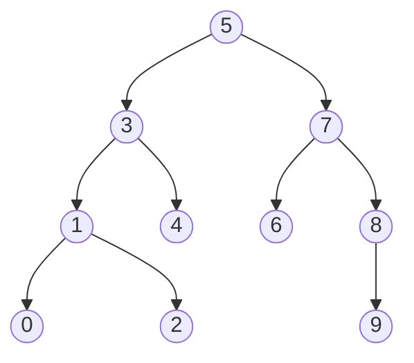

## 前言

二叉树的基础内容通常包括树的概念、四种遍历方式以及节点个数、高度等递归问题。本文在这些基础上继续学习二叉搜索树，并整理二叉树中常见的进阶面试题。

学习二叉搜索树还有一个重要目的：为后续理解 `std::set`、`std::map`、AVL 树和红黑树打下基础。

本文主要内容如下：

1. 二叉搜索树的性质；
2. 二叉搜索树的查找、插入和删除；
3. 二叉搜索树的完整 C++ 实现；
4. K 模型和 KV 模型；
5. 二叉搜索树的性能分析；
6. 十道经典二叉树面试题。

## 一、二叉搜索树

### 1.1 基本概念

二叉搜索树又称为二叉排序树，英文为 **Binary Search Tree，BST**。

一棵二叉树是二叉搜索树，需要满足以下条件：

- 左子树不为空时，左子树中所有节点的值都小于根节点的值；
- 右子树不为空时，右子树中所有节点的值都大于根节点的值；
- 左子树和右子树本身也分别是二叉搜索树。

例如，依次插入下面的数据：

```cpp
int values[] = {5, 3, 4, 1, 7, 8, 2, 6, 0, 9};
```

可以得到如下二叉搜索树：



二叉搜索树最重要的性质是：

> 对二叉搜索树进行中序遍历，可以得到一个升序序列。

上述二叉搜索树的中序遍历结果为：

```text
0 1 2 3 4 5 6 7 8 9
```

这也是判断一棵树是否为二叉搜索树时经常使用的思路。

### 1.2 节点结构

K 模型的二叉搜索树只需要保存一个关键字：

```cpp
template<class K>
struct BSTNode
{
    explicit BSTNode(const K& key)
        : _left(nullptr)
        , _right(nullptr)
        , _key(key)
    {
    }

    BSTNode<K>* _left;
    BSTNode<K>* _right;
    K _key;
};
```

每个节点包含三部分：

- `_left`：指向左孩子；
- `_right`：指向右孩子；
- `_key`：节点保存的关键字。

## 二、二叉搜索树的查找

### 2.1 查找思路

从根节点开始，将目标值 `key` 与当前节点的值进行比较：

- `key < 当前值`：目标只可能在左子树中；
- `key > 当前值`：目标只可能在右子树中；
- `key == 当前值`：查找成功；
- 走到空指针：树中不存在目标值。

查找过程每次都可以排除一棵子树，这正是二叉搜索树能够提高查找效率的原因。

### 2.2 迭代实现

```cpp
Node* Find(const K& key)
{
    Node* cur = _root;

    while (cur != nullptr)
    {
        if (key < cur->_key)
        {
            cur = cur->_left;
        }
        else if (key > cur->_key)
        {
            cur = cur->_right;
        }
        else
        {
            return cur;
        }
    }

    return nullptr;
}
```

若树的高度为 `h`，查找的时间复杂度为：

```text
O(h)
```

## 三、二叉搜索树的插入

### 3.1 插入思路

二叉搜索树的新节点一定插入在某个空位置上。

具体步骤如下：

1. 如果树为空，直接创建根节点；
2. 如果树不为空，从根节点开始查找；
3. 使用 `parent` 保存当前节点的父节点；
4. 找到空位置后，根据大小关系将新节点连接到 `parent` 的左侧或右侧。

本文实现的是不允许关键字重复的二叉搜索树。如果待插入的关键字已经存在，就返回 `false`。

### 3.2 插入实现

```cpp
bool Insert(const K& key)
{
    if (_root == nullptr)
    {
        _root = new Node(key);
        return true;
    }

    Node* parent = nullptr;
    Node* cur = _root;

// 1.找到父亲节点
    while (cur != nullptr)
    {
        parent = cur;

        if (key < cur->_key)
        {
            cur = cur->_left;
        }
        else if (key > cur->_key)
        {
            cur = cur->_right;
        }
        else
        {
            return false;
        }
    }

// 2.创建节点
    Node* newNode = new Node(key);

// 3.判断然后，进行插入
    if (key < parent->_key)
    {
        parent->_left = newNode;
    }
    else
    {
        parent->_right = newNode;
    }

    return true;
}
```

插入操作本质上要先查找插入位置，因此时间复杂度同样为 `O(h)`。

## 四、二叉搜索树的删除

删除是二叉搜索树中最容易出错的操作。首先需要找到待删除节点，然后根据其孩子情况分别处理。

### 4.1 删除情况分类

| 待删除节点的情况 | 处理方式 |
| --- | --- |
| 没有孩子 | 直接删除，并将父节点中对应指针置空 |
| 只有左孩子 | 让父节点指向待删除节点的左孩子 |
| 只有右孩子 | 让父节点指向待删除节点的右孩子 |
| 左右孩子都存在 | 使用前驱或后继节点替换，再删除替代节点 |

“没有孩子”可以合并到“左孩子为空”或者“右孩子为空”的分支中，因此代码通常只写三种情况。

还要特别注意：待删除节点可能就是根节点，此时不存在父节点，需要直接修改 `_root`。

### 4.2 左孩子为空

待删除节点没有左孩子时，用它的右孩子接替它的位置：

```cpp
if (cur->_left == nullptr)
{
    Node* child = cur->_right;

    if (parent == nullptr)
    {
        _root = child;              // 1. 根节点
    }
    else if (parent->_left == cur)
    {
        parent->_left = child;     // 2. parent的左边
    }
    else
    {
        parent->_right = child;    // 3.  parent的右边
    }

    delete cur;
}
```

当待删除节点是叶子节点时，`cur->_right` 也是空指针，因此这段代码同样能够正确处理。

```
													parent
												 cur       cur
										             right     right
```

### 4.3 右孩子为空

待删除节点没有右孩子时，用它的左孩子接替它的位置：

```cpp
else if (cur->_right == nullptr)
{
    Node* child = cur->_left;

    if (parent == nullptr)
    {
        _root = child;
    }
    else if (parent->_left == cur)
    {
        parent->_left = child;
    }
    else
    {
        parent->_right = child;
    }

    delete cur;
}
```

```
									                  parent
												 cur       cur
										       left      left
```


### 4.4 左右孩子都存在

当待删除节点同时拥有左右孩子时，不能简单地让某个孩子接替它，否则可能破坏二叉搜索树的结构。

可以选择以下任意一种替代节点：

- 左子树中的最大节点，也叫中序前驱；
- 右子树中的最小节点，也叫中序后继。

下面选择右子树中的最小节点：

1. 进入待删除节点的右子树；
2. 不断向左查找，找到右子树中的最小节点；
3. 将该节点的值赋给待删除节点；
4. 删除右子树中的最小节点。

右子树中的最小节点一定没有左孩子，因此最终又转换成了简单删除问题。

```cpp
else
{
    Node* successorParent = cur;   //  待删除的节点 
    Node* successor = cur->_right;  // 带删除的节点 右边

// 1.右边小的节点
    while (successor->_left != nullptr)
    {
        successorParent = successor;
        successor = successor->_left;
    }

// 2.更新节点
    cur->_key = successor->_key;

// 3.判断是那边的left
    if (successorParent->_left == successor)
    {
        successorParent->_left = successor->_right;
    }
    else
    {
        successorParent->_right = successor->_right;
    }

    delete successor;
}
```


### 4.5 删除操作中的常见错误

1. 忘记单独处理根节点；
2. 两个删除分支都判断 `cur->_right == nullptr`；
3. 找后继节点时忘记保存后继节点的父节点；
4. 替换值之后没有真正删除后继节点；
5. 删除节点后继续访问已经释放的内存；
6. 没有考虑目标值不存在的情况。

## 五、二叉搜索树的完整实现

下面给出一份可以直接编译运行的 K 模型二叉搜索树。

```cpp
#include <iostream>

template<class K>
class BSTree
{
private:
    struct Node
    {
        explicit Node(const K& key)
            : _left(nullptr)
            , _right(nullptr)
            , _key(key)
        {}

        Node* _left;
        Node* _right;
        K _key;
    };

public:
    BSTree()
        : _root(nullptr)
    {
    }

    // 当前版本没有实现深拷贝，禁止编译器生成浅拷贝。
    BSTree(const BSTree&) = delete;
    BSTree& operator=(const BSTree&) = delete;

    ~BSTree()
    {
        Destroy(_root);
        _root = nullptr;
    }

    Node* Find(const K& key)
    {
        Node* cur = _root;

        while (cur != nullptr)
        {
            if (key < cur->_key)
            {
                cur = cur->_left;
            }
            else if (key > cur->_key)
            {
                cur = cur->_right;
            }
            else
            {
                return cur;
            }
        }

        return nullptr;
    }

    const Node* Find(const K& key) const
    {
        const Node* cur = _root;

        while (cur != nullptr)
        {
            if (key < cur->_key)
            {
                cur = cur->_left;
            }
            else if (key > cur->_key)
            {
                cur = cur->_right;
            }
            else
            {
                return cur;
            }
        }

        return nullptr;
    }

    bool Insert(const K& key)
    {
        if (_root == nullptr)
        {
            _root = new Node(key);
            return true;
        }

        Node* parent = nullptr;
        Node* cur = _root;

        while (cur != nullptr)
        {
            parent = cur;

            if (key < cur->_key)
            {
                cur = cur->_left;
            }
            else if (key > cur->_key)
            {
                cur = cur->_right;
            }
            else
            {
                return false;
            }
        }

        Node* newNode = new Node(key);

        if (key < parent->_key)
        {
            parent->_left = newNode;
        }
        else
        {
            parent->_right = newNode;
        }

        return true;
    }

    bool Erase(const K& key)
    {
        Node* parent = nullptr;
        Node* cur = _root;

        while (cur != nullptr)
        {
            if (key < cur->_key)
            {
                parent = cur;
                cur = cur->_left;
            }
            else if (key > cur->_key)
            {
                parent = cur;
                cur = cur->_right;
            }
            else
            {
                break;
            }
        }

        if (cur == nullptr)
        {
            return false;
        }

        if (cur->_left == nullptr)
        {
            Node* child = cur->_right;

            if (parent == nullptr)
            {
                _root = child;
            }
            else if (parent->_left == cur)
            {
                parent->_left = child;
            }
            else
            {
                parent->_right = child;
            }

            delete cur;
        }
        else if (cur->_right == nullptr)
        {
            Node* child = cur->_left;

            if (parent == nullptr)
            {
                _root = child;
            }
            else if (parent->_left == cur)
            {
                parent->_left = child;
            }
            else
            {
                parent->_right = child;
            }

            delete cur;
        }
        else
        {
            Node* successorParent = cur;
            Node* successor = cur->_right;

            while (successor->_left != nullptr)
            {
                successorParent = successor;
                successor = successor->_left;
            }

            cur->_key = successor->_key;

            if (successorParent->_left == successor)
            {
                successorParent->_left = successor->_right;
            }
            else
            {
                successorParent->_right = successor->_right;
            }

            delete successor;
        }

        return true;
    }

    void InOrder() const
    {
        InOrder(_root);
        std::cout << '\n';
    }

private:
    static void Destroy(Node* root)
    {
        if (root == nullptr)
        {
            return;
        }

        Destroy(root->_left);
        Destroy(root->_right);
        delete root;
    }

    static void InOrder(const Node* root)
    {
        if (root == nullptr)
        {
            return;
        }

        InOrder(root->_left);
        std::cout << root->_key << ' ';
        InOrder(root->_right);
    }

private:
    Node* _root;
};

int main()
{
    BSTree<int> tree;
    int values[] = {5, 3, 4, 1, 7, 8, 2, 6, 0, 9};

    for (int value : values)
    {
        tree.Insert(value);
    }

    tree.InOrder();

    std::cout << std::boolalpha;
    std::cout << "Find 6: " << (tree.Find(6) != nullptr) << '\n';
    std::cout << "Find 10: " << (tree.Find(10) != nullptr) << '\n';

    tree.Erase(0);  // 删除叶子节点
    tree.Erase(8);  // 删除只有一个孩子的节点
    tree.Erase(5);  // 删除拥有两个孩子的根节点
    tree.InOrder();

    return 0;
}
```

运行结果：

```text
0 1 2 3 4 5 6 7 8 9
Find 6: true
Find 10: false
1 2 3 4 6 7 9
```

这里显式禁用了拷贝构造和拷贝赋值。原因是类中保存了裸指针，如果直接使用编译器生成的成员级拷贝，就会造成两棵树指向同一批节点，最终引发重复释放。

如果希望二叉搜索树支持拷贝，就需要递归复制所有节点，实现真正的深拷贝。

## 六、K 模型与 KV 模型

### 6.1 K 模型

K 模型只保存关键字 `Key`，主要用于判断某个关键字是否存在。

典型应用包括：

- 检查一个单词是否在词库中；
- 对数据进行去重；
- 实现类似 `std::set` 的结构。

例如，将词库中的每个单词作为关键字插入二叉搜索树。检查拼写时，只需在树中查找目标单词是否存在。

### 6.2 KV 模型

KV 模型保存 `<Key, Value>` 键值对，通过 `Key` 查找对应的 `Value`。

典型应用包括：

- 英汉词典：`<英文单词, 中文含义>`；
- 单词计数：`<单词, 出现次数>`；
- 学生信息：`<学号, 学生信息>`；
- 实现类似 `std::map` 的结构。

K 模型与 KV 模型的区别如下：

| 模型 | 节点保存内容 | 主要功能 | 类似的 STL 容器 |
| --- | --- | --- | --- |
| K 模型 | `Key` | 判断关键字是否存在 | `std::set` |
| KV 模型 | `Key + Value` | 根据关键字查找对应值 | `std::map` |

### 6.3 KV 节点结构

```cpp
template<class K, class V>
struct BSTNode
{
    BSTNode(const K& key, const V& value)
        : _left(nullptr)
        , _right(nullptr)
        , _key(key)
        , _value(value)
    {
    }

    BSTNode<K, V>* _left;
    BSTNode<K, V>* _right;
    K _key;
    V _value;
};
```

需要注意：

> KV 模型中节点的排列顺序由 `Key` 决定，查找和比较时也只比较 `Key`，而不是比较 `Value`。

### 6.4 KV 模型的查找与插入

```cpp
template<class K, class V>
class BSTreeKV
{
private:
    using Node = BSTNode<K, V>;

public:
    BSTreeKV()
        : _root(nullptr)
    {
    }

    BSTreeKV(const BSTreeKV&) = delete;
    BSTreeKV& operator=(const BSTreeKV&) = delete;

    ~BSTreeKV()
    {
        Destroy(_root);
        _root = nullptr;
    }

    V* Find(const K& key)
    {
        Node* cur = _root;

        while (cur != nullptr)
        {
            if (key < cur->_key)
            {
                cur = cur->_left;
            }
            else if (key > cur->_key)
            {
                cur = cur->_right;
            }
            else
            {
                return &cur->_value;
            }
        }

        return nullptr;
    }

    bool Insert(const K& key, const V& value)
    {
        if (_root == nullptr)
        {
            _root = new Node(key, value);
            return true;
        }

        Node* parent = nullptr;
        Node* cur = _root;

        while (cur != nullptr)
        {
            parent = cur;

            if (key < cur->_key)
            {
                cur = cur->_left;
            }
            else if (key > cur->_key)
            {
                cur = cur->_right;
            }
            else
            {
                return false;
            }
        }

        cur = new Node(key, value);

        if (key < parent->_key)
        {
            parent->_left = cur;
        }
        else
        {
            parent->_right = cur;
        }

        return true;
    }

private:
    static void Destroy(Node* root)
    {
        if (root == nullptr)
        {
            return;
        }

        Destroy(root->_left);
        Destroy(root->_right);
        delete root;
    }

private:
    Node* _root;
};
```

为了突出 KV 模型，这里省略了删除接口和 `const` 版本的查找接口，但保留了析构与基本拷贝控制，避免出现内存泄漏和浅拷贝问题。

## 七、二叉搜索树的性能分析

### 7.1 时间复杂度由树高决定

二叉搜索树的查找、插入和删除都需要从根节点向下查找，因此它们的时间复杂度都与树高 `h` 有关：

| 操作 | 平均时间复杂度 | 最坏时间复杂度 |
| --- | --- | --- |
| 查找 | `O(log n)` | `O(n)` |
| 插入 | `O(log n)` | `O(n)` |
| 删除 | `O(log n)` | `O(n)` |
| 中序遍历 | `O(n)` | `O(n)` |

### 7.2 最优情况

当树的结构接近平衡二叉树时，树高约为：

```text
h ≈ log₂n
```

此时每次比较大约能够排除一半节点，查找、插入和删除的平均时间复杂度为 `O(log n)`。

### 7.3 最坏情况

如果按照有序序列插入普通二叉搜索树：

```text
1 2 3 4 5 6 7 8 9
```

二叉搜索树会退化成类似单链表的结构：


此时树高为 `n`，查找、插入和删除的最坏时间复杂度都退化为 `O(n)`，二叉搜索树的性能优势也就消失了。

### 7.4 如何解决退化问题

普通二叉搜索树不会主动维护平衡。为了让树在不同插入顺序下仍保持较低的高度，可以使用自平衡二叉搜索树：

- AVL 树：严格控制左右子树的高度差；
- 红黑树：通过颜色约束保证近似平衡；
- Treap：同时维护二叉搜索树性质和随机优先级。

`std::map` 和 `std::set` 的常见底层实现是红黑树，因此学习二叉搜索树是理解这些容器的基础。

## 八、二叉树进阶面试题

下面统一使用 LeetCode 中常见的二叉树节点定义：

```cpp
#include <algorithm>
#include <queue>
#include <stack>
#include <string>
#include <unordered_map>
#include <utility>
#include <vector>

struct TreeNode
{
    int val;
    TreeNode* left;
    TreeNode* right;

    explicit TreeNode(int x)
        : val(x)
        , left(nullptr)
        , right(nullptr)
    {
    }
};
```

### 8.1 根据二叉树创建字符串

对应题目：LeetCode 606，Construct String from Binary Tree。

#### 核心思路

按照前序遍历构造字符串：

- 空节点返回空字符串；
- 叶子节点只保存自身；
- 有左子树时，添加 `(左子树)`；
- 有右子树时，必须保留左子树对应的括号，即使左子树为空。

最后一点非常重要。例如根节点只有右孩子时，结果应为：

```text
1()(2)
```

不能写成 `1(2)`，否则无法区分 `2` 是左孩子还是右孩子。

```cpp
class Solution
{
public:
    std::string tree2str(TreeNode* root)
    {
        if (root == nullptr)
        {
            return "";
        }

        std::string result = std::to_string(root->val);

        if (root->left != nullptr || root->right != nullptr)
        {
            result += "(" + tree2str(root->left) + ")";
        }

        if (root->right != nullptr)
        {
            result += "(" + tree2str(root->right) + ")";
        }

        return result;
    }
};
```

时间复杂度为 `O(n)`，递归栈空间复杂度为 `O(h)`。

### 8.2 二叉树的层序遍历

对应题目：LeetCode 102，Binary Tree Level Order Traversal。

层序遍历使用队列实现。每轮开始时，队列长度正好等于当前层的节点数量。

```cpp
class Solution
{
public:
    std::vector<std::vector<int>> levelOrder(TreeNode* root)
    {
        std::vector<std::vector<int>> result;

        if (root == nullptr)
        {
            return result;
        }

        std::queue<TreeNode*> nodes;
        nodes.push(root);

        while (!nodes.empty())
        {
            int levelSize = static_cast<int>(nodes.size());
            std::vector<int> level;
            level.reserve(levelSize);

            for (int i = 0; i < levelSize; ++i)
            {
                TreeNode* cur = nodes.front();
                nodes.pop();
                level.push_back(cur->val);

                if (cur->left != nullptr)
                {
                    nodes.push(cur->left);
                }

                if (cur->right != nullptr)
                {
                    nodes.push(cur->right);
                }
            }

            result.push_back(std::move(level));
        }

        return result;
    }
};
```

时间复杂度为 `O(n)`，队列的空间复杂度最坏为 `O(n)`。

### 8.3 二叉树的自底向上层序遍历

对应题目：LeetCode 107，Binary Tree Level Order Traversal II。

先按照正常顺序完成层序遍历，最后将二维数组整体逆置即可：

```cpp
class Solution
{
public:
    std::vector<std::vector<int>> levelOrderBottom(TreeNode* root)
    {
        std::vector<std::vector<int>> result;

        if (root == nullptr)
        {
            return result;
        }

        std::queue<TreeNode*> nodes;
        nodes.push(root);

        while (!nodes.empty())
        {
            int levelSize = static_cast<int>(nodes.size());
            std::vector<int> level;

            while (levelSize-- > 0)
            {
                TreeNode* cur = nodes.front();
                nodes.pop();
                level.push_back(cur->val);

                if (cur->left != nullptr)
                {
                    nodes.push(cur->left);
                }

                if (cur->right != nullptr)
                {
                    nodes.push(cur->right);
                }
            }

            result.push_back(std::move(level));
        }

        std::reverse(result.begin(), result.end());
        return result;
    }
};
```

时间复杂度为 `O(n)`，空间复杂度为 `O(n)`。

### 8.4 二叉树的最近公共祖先

对应题目：LeetCode 236，Lowest Common Ancestor of a Binary Tree。

#### 递归定义

从当前节点开始：

1. 当前节点为空，返回空；
2. 当前节点就是 `p` 或 `q`，返回当前节点；
3. 分别在左右子树中查找；
4. 左右都找到，说明当前节点就是最近公共祖先；
5. 只有一侧找到，将这一侧的结果向上返回。

```cpp
class Solution
{
public:
    TreeNode* lowestCommonAncestor(
        TreeNode* root,
        TreeNode* p,
        TreeNode* q)
    {
        if (root == nullptr || root == p || root == q)
        {
            return root;
        }

        TreeNode* leftResult =
            lowestCommonAncestor(root->left, p, q);
        TreeNode* rightResult =
            lowestCommonAncestor(root->right, p, q);

        if (leftResult != nullptr && rightResult != nullptr)
        {
            return root;
        }

        return leftResult != nullptr ? leftResult : rightResult;
    }
};
```

时间复杂度为 `O(n)`，递归栈空间复杂度为 `O(h)`。

如果题目明确给出的是二叉搜索树，还可以利用关键字大小关系，将复杂度优化为 `O(h)`。

### 8.5 二叉搜索树转换为排序双向链表

对应题目：剑指 Offer 36。

二叉搜索树的中序遍历结果有序，因此可以在中序遍历过程中完成指针连接：

- `left` 作为双向链表的前驱指针；
- `right` 作为双向链表的后继指针；
- `prev` 保存刚刚访问过的节点；
- `head` 保存链表头节点。

```cpp
class Solution
{
public:
    Node* treeToDoublyList(Node* root)
    {
        if (root == nullptr)
        {
            return nullptr;
        }

        Node* prev = nullptr;
        Node* head = nullptr;
        InOrder(root, prev, head);

        // 首尾相连，构成循环双向链表。
        head->left = prev;
        prev->right = head;

        return head;
    }

private:
    void InOrder(Node* cur, Node*& prev, Node*& head)
    {
        if (cur == nullptr)
        {
            return;
        }

        InOrder(cur->left, prev, head);

        if (prev == nullptr)
        {
            head = cur;
        }
        else
        {
            prev->right = cur;
            cur->left = prev;
        }

        prev = cur;
        InOrder(cur->right, prev, head);
    }
};
```

时间复杂度为 `O(n)`，递归栈空间复杂度为 `O(h)`。

如果题目只要求普通双向链表，删除首尾相连的两行代码即可。

### 8.6 根据前序遍历和中序遍历构造二叉树

对应题目：LeetCode 105，Construct Binary Tree from Preorder and Inorder Traversal。

#### 核心规律

- 前序遍历的第一个元素是当前子树的根节点；
- 在中序遍历中，根节点左侧是左子树，右侧是右子树；
- 使用哈希表记录每个值在中序序列中的位置，避免反复查找。

```cpp
class Solution
{
public:
    TreeNode* buildTree(
        std::vector<int>& preorder,
        std::vector<int>& inorder)
    {
        for (int i = 0; i < static_cast<int>(inorder.size()); ++i)
        {
            _inorderIndex[inorder[i]] = i;
        }

        return Build(
            preorder,
            0,
            static_cast<int>(preorder.size()) - 1,
            0,
            static_cast<int>(inorder.size()) - 1);
    }

private:
    TreeNode* Build(
        const std::vector<int>& preorder,
        int preLeft,
        int preRight,
        int inLeft,
        int inRight)
    {
        if (preLeft > preRight)
        {
            return nullptr;
        }

        int rootValue = preorder[preLeft];
        int rootIndex = _inorderIndex[rootValue];
        int leftSize = rootIndex - inLeft;

        TreeNode* root = new TreeNode(rootValue);
        root->left = Build(
            preorder,
            preLeft + 1,
            preLeft + leftSize,
            inLeft,
            rootIndex - 1);
        root->right = Build(
            preorder,
            preLeft + leftSize + 1,
            preRight,
            rootIndex + 1,
            inRight);

        return root;
    }

private:
    std::unordered_map<int, int> _inorderIndex;
};
```

时间复杂度为 `O(n)`，额外空间复杂度为 `O(n)`。

只有当节点值互不相同，并且遍历序列合法时，前序与中序序列才能唯一确定一棵二叉树。

### 8.7 根据中序遍历和后序遍历构造二叉树

对应题目：LeetCode 106，Construct Binary Tree from Inorder and Postorder Traversal。

#### 核心规律

- 后序遍历的最后一个元素是当前子树的根节点；
- 在中序遍历中确定左右子树的范围；
- 根据左子树大小划分后序遍历区间。

```cpp
class Solution
{
public:
    TreeNode* buildTree(
        std::vector<int>& inorder,
        std::vector<int>& postorder)
    {
        for (int i = 0; i < static_cast<int>(inorder.size()); ++i)
        {
            _inorderIndex[inorder[i]] = i;
        }

        return Build(
            inorder,
            0,
            static_cast<int>(inorder.size()) - 1,
            postorder,
            0,
            static_cast<int>(postorder.size()) - 1);
    }

private:
    TreeNode* Build(
        const std::vector<int>& inorder,
        int inLeft,
        int inRight,
        const std::vector<int>& postorder,
        int postLeft,
        int postRight)
    {
        if (inLeft > inRight)
        {
            return nullptr;
        }

        int rootValue = postorder[postRight];
        int rootIndex = _inorderIndex[rootValue];
        int leftSize = rootIndex - inLeft;

        TreeNode* root = new TreeNode(rootValue);
        root->left = Build(
            inorder,
            inLeft,
            rootIndex - 1,
            postorder,
            postLeft,
            postLeft + leftSize - 1);
        root->right = Build(
            inorder,
            rootIndex + 1,
            inRight,
            postorder,
            postLeft + leftSize,
            postRight - 1);

        return root;
    }

private:
    std::unordered_map<int, int> _inorderIndex;
};
```

时间复杂度为 `O(n)`，额外空间复杂度为 `O(n)`。

需要注意，`inorder` 参数在辅助函数中只是用于表达区间含义。真正确定根节点位置时，使用的是提前建立的哈希表。

### 8.8 前序遍历的非递归实现

前序遍历顺序为：

```text
根节点 -> 左子树 -> 右子树
```

栈具有后进先出的特点，因此需要先压入右孩子，再压入左孩子。

```cpp
class Solution
{
public:
    std::vector<int> preorderTraversal(TreeNode* root)
    {
        std::vector<int> result;

        if (root == nullptr)
        {
            return result;
        }

        std::stack<TreeNode*> nodes;
        nodes.push(root);

        while (!nodes.empty())
        {
            TreeNode* cur = nodes.top();
            nodes.pop();
            result.push_back(cur->val);

            if (cur->right != nullptr)
            {
                nodes.push(cur->right);
            }

            if (cur->left != nullptr)
            {
                nodes.push(cur->left);
            }
        }

        return result;
    }
};
```

时间复杂度为 `O(n)`，栈空间复杂度为 `O(h)`。

### 8.9 中序遍历的非递归实现

中序遍历顺序为：

```text
左子树 -> 根节点 -> 右子树
```

迭代过程可以分成两步：

1. 沿左孩子不断入栈；
2. 左侧走到空后，弹出并访问栈顶节点，再处理其右子树。

```cpp
class Solution
{
public:
    std::vector<int> inorderTraversal(TreeNode* root)
    {
        std::vector<int> result;
        std::stack<TreeNode*> nodes;
        TreeNode* cur = root;

        while (cur != nullptr || !nodes.empty())
        {
            while (cur != nullptr)
            {
                nodes.push(cur);
                cur = cur->left;
            }

            cur = nodes.top();
            nodes.pop();
            result.push_back(cur->val);
            cur = cur->right;
        }

        return result;
    }
};
```

时间复杂度为 `O(n)`，栈空间复杂度为 `O(h)`。

### 8.10 后序遍历的非递归实现

后序遍历顺序为：

```text
左子树 -> 右子树 -> 根节点
```

难点在于：从栈顶取出节点时，必须先判断其右子树是否已经访问。

使用 `lastVisited` 记录上一次访问的节点：

- 如果栈顶节点存在尚未访问的右子树，就进入右子树；
- 否则说明左右子树都处理完毕，可以访问栈顶节点。

```cpp
class Solution
{
public:
    std::vector<int> postorderTraversal(TreeNode* root)
    {
        std::vector<int> result;
        std::stack<TreeNode*> nodes;
        TreeNode* cur = root;
        TreeNode* lastVisited = nullptr;

        while (cur != nullptr || !nodes.empty())
        {
            while (cur != nullptr)
            {
                nodes.push(cur);
                cur = cur->left;
            }

            TreeNode* top = nodes.top();

            if (top->right != nullptr && top->right != lastVisited)
            {
                cur = top->right;
            }
            else
            {
                result.push_back(top->val);
                lastVisited = top;
                nodes.pop();
            }
        }

        return result;
    }
};
```

时间复杂度为 `O(n)`，栈空间复杂度为 `O(h)`。

## 九、递归与迭代遍历对比

| 遍历方式 | 访问顺序 | 迭代实现的关键数据结构 |
| --- | --- | --- |
| 前序遍历 | 根、左、右 | 栈，先压右再压左 |
| 中序遍历 | 左、根、右 | 栈，持续沿左侧入栈 |
| 后序遍历 | 左、右、根 | 栈和上次访问节点 |
| 层序遍历 | 从上到下、从左到右 | 队列 |

递归写法通常更简洁，迭代写法则能够显式控制辅助栈，避免递归层数过深时发生调用栈溢出。

无论采用递归还是迭代，每个节点都只会被处理有限次，因此遍历的时间复杂度都是 `O(n)`。

## 十、常见面试问题

### 10.1 为什么二叉搜索树的中序遍历有序？

因为任意节点都满足：

```text
左子树所有值 < 根节点值 < 右子树所有值
```

中序遍历恰好按照“左子树、根节点、右子树”的顺序访问。该性质对每棵子树递归成立，因此最终得到整体升序序列。

### 10.2 二叉搜索树一定比顺序表查找快吗？

不一定。

- 平衡或接近平衡时，二叉搜索树查找复杂度约为 `O(log n)`；
- 退化成单支树时，查找复杂度为 `O(n)`；
- 有序顺序表可以使用二分查找，查找复杂度同样为 `O(log n)`；
- 但顺序表中间位置的插入和删除通常需要搬移元素，复杂度为 `O(n)`。

比较数据结构时，不能只看某一个操作，还需要结合数据是否有序、是否频繁增删以及内存访问特点。

### 10.3 为什么删除拥有两个孩子的节点时要找前驱或后继？

前驱和后继与待删除节点在有序序列中相邻：

- 左子树最大节点小于当前节点，但大于左子树中的其他节点；
- 右子树最小节点大于当前节点，但小于右子树中的其他节点。

使用它们替换待删除节点，不会破坏二叉搜索树的大小关系。

### 10.4 为什么普通二叉搜索树会退化？

普通二叉搜索树只保证左小右大，不限制左右子树的高度。如果插入顺序本身有序，新节点会一直被插入同一个方向，最终形成单支结构。

### 10.5 `std::map` 和 `std::set` 为什么通常不直接使用普通二叉搜索树？

因为普通二叉搜索树的高度缺乏保证，最坏复杂度可能退化为 `O(n)`。红黑树能够通过旋转和颜色调整维持近似平衡，从而保证查找、插入和删除的时间复杂度为 `O(log n)`。

## 十一、总结

本文需要重点掌握以下内容：

1. 二叉搜索树满足左子树小于根、右子树大于根；
2. 二叉搜索树的中序遍历结果有序；
3. 查找、插入和删除的复杂度取决于树高；
4. 删除节点时要区分没有孩子、只有一个孩子和拥有两个孩子；
5. 删除拥有两个孩子的节点，可以使用中序前驱或中序后继替换；
6. K 模型只保存关键字，KV 模型保存键值对；
7. 普通二叉搜索树可能退化为单支树，AVL 树和红黑树用于解决平衡问题；
8. 前序、中序和后序遍历的迭代实现都依赖栈，层序遍历依赖队列；
9. 前序配合中序、中序配合后序可以重建二叉树；
10. 二叉搜索树是继续学习 `std::map`、`std::set`、AVL 树和红黑树的重要基础。
